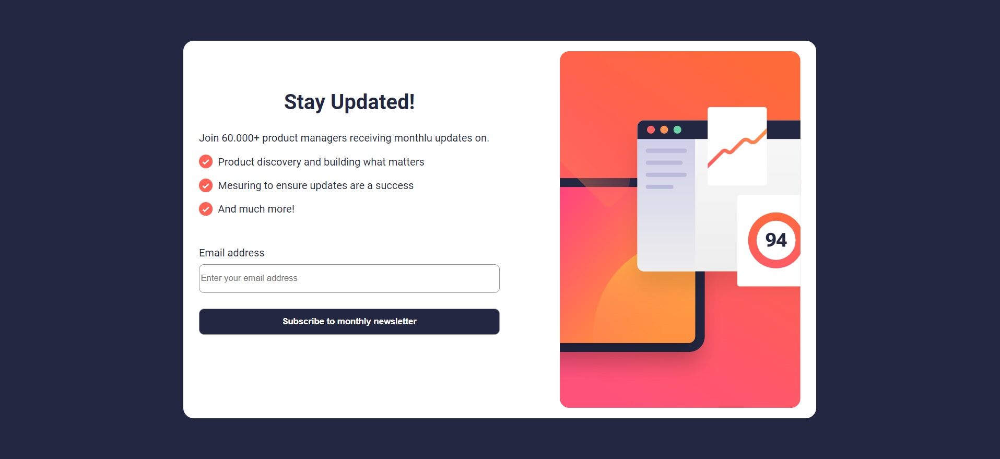
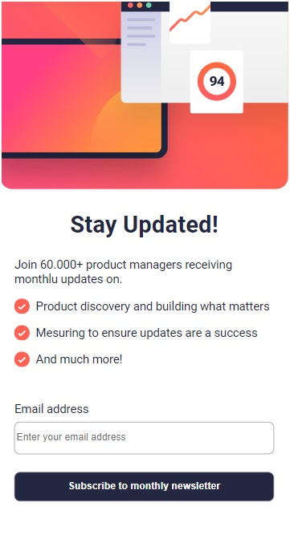
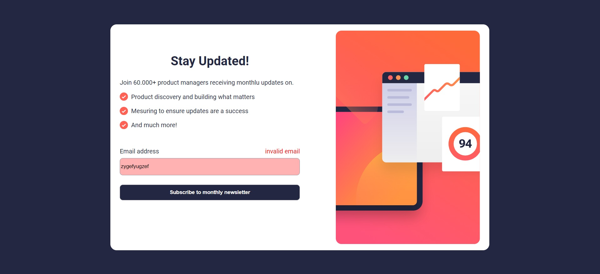
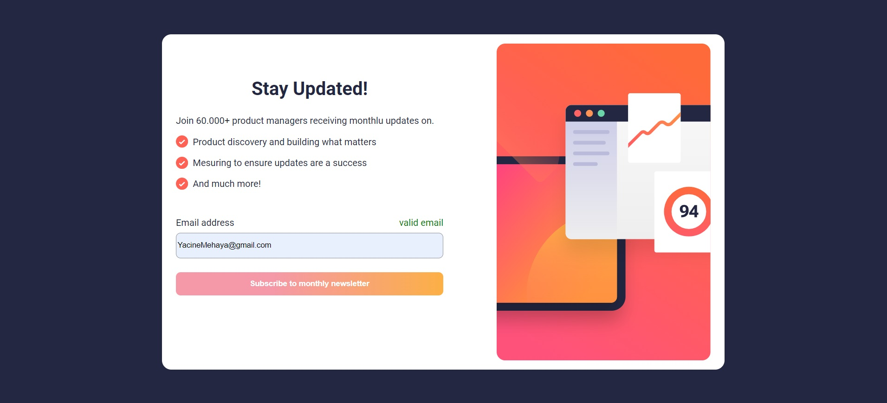

# Newsletter sign-up form with success message

Newsletter sign-up form with success message is frontend mentor challenge junior level

## Overview

this UI verify if your email is valid or no using regular expression than if it is , it show a model says that an email is sent to your email box
it built using with HTML , CSS , Javascript

## Screenshots

*Home Page of the Challenge.*

*Home Page mobile view of the Challenge.*

*Error case.*

*Validation email succed case.*

*Feature Page showcasing the amazing capabilities.*

## Files

- **index.html**: The main HTML file.
- **style.css**: The form CSS file for styling.
- **model_style.css**: The model CSS file for styling.
- **script.js**: The main JavaScript file for scripting.

## Usage

1. Clone the repository.
2. Open `index.html` in your preferred web browser.
3. Explore the awesome features!

## Folder Structure

- **css**: Contains the CSS files.
- **js**: Contains the JavaScript files.
- **screenshots**: Contains screenshots of the application.

## Author

Yassine Mehia

## License

This project is licensed under the MIT License - see the [LICENSE.md](LICENSE.md) file for details.
